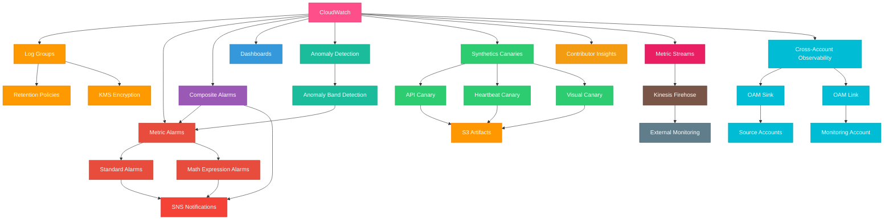

# terraform-aws-cloudwatch

Terraform module for comprehensive AWS CloudWatch observability including log groups, metric alarms, composite alarms, dashboards, anomaly detection, Synthetics canaries, Contributor Insights, metric streams, and cross-account observability.

## Architecture



## Features

- **Log Groups** - Managed log groups with retention policies and KMS encryption
- **Metric Alarms** - Standard and math-expression based alarms with SNS actions
- **Composite Alarms** - Logical combinations of metric alarms
- **Dashboards** - JSON-defined CloudWatch dashboards
- **Anomaly Detection** - Automatic anomaly band detection on metrics
- **Synthetics Canaries** - Automated endpoint monitoring with configurable schedules
- **Contributor Insights** - Top-N analysis on log data
- **Metric Streams** - Real-time metric streaming to external destinations via Firehose
- **Cross-Account Observability** - OAM sinks and links for centralized monitoring

## Usage

```hcl
module "cloudwatch" {
  source = "path/to/terraform-aws-cloudwatch"

  name = "my-app"

  log_groups = {
    "/app/web" = {
      retention_in_days = 30
    }
  }

  metric_alarms = {
    high-cpu = {
      comparison_operator = "GreaterThanThreshold"
      evaluation_periods  = 2
      metric_name         = "CPUUtilization"
      namespace           = "AWS/EC2"
      threshold           = 80
    }
  }

  tags = {
    Environment = "production"
  }
}
```

## Examples

- [Basic](examples/basic/) - Log groups and metric alarms
- [Complete](examples/complete/) - Full observability stack with all features

## Requirements

| Name      | Version  |
|-----------|----------|
| terraform | >= 1.5.0 |
| aws       | >= 6.53.0 |

## License

MIT License - see [LICENSE](LICENSE) for details.
